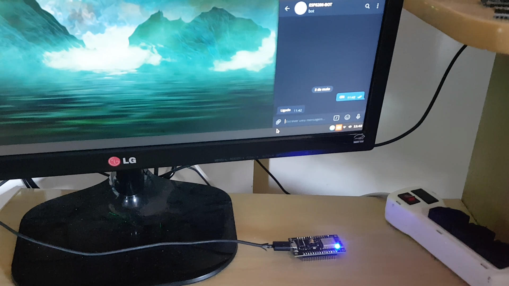

# 01-led-telegram-bot

## Objetivo

O objetivo desse programa é demonstrar a utilização do BOT Telegram para ligar e desligar o LED padrão de uma placa NodeMCU.

### Hardware

O hardware necessário para esse exemplo será apenas uma placa NodeMCU, o LED que acende está embutido na placa.

### Vídeo

### Requisitos

As instruções para obter o token e as bibliotecas que são necessárias estão no [link](../README.md).
