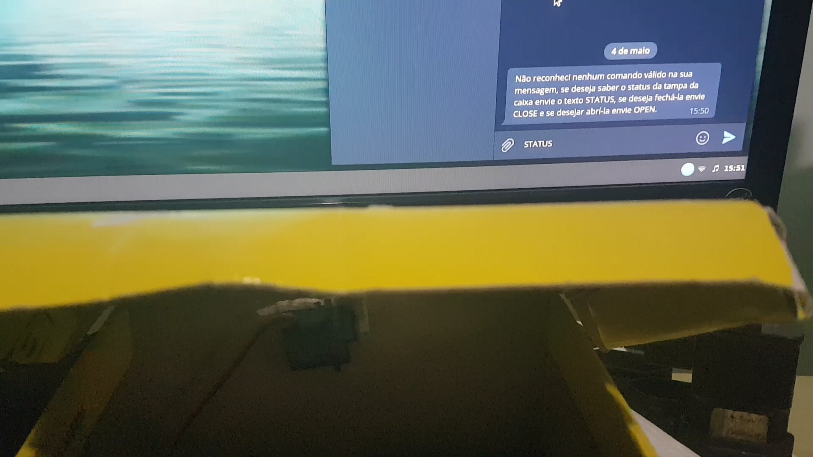
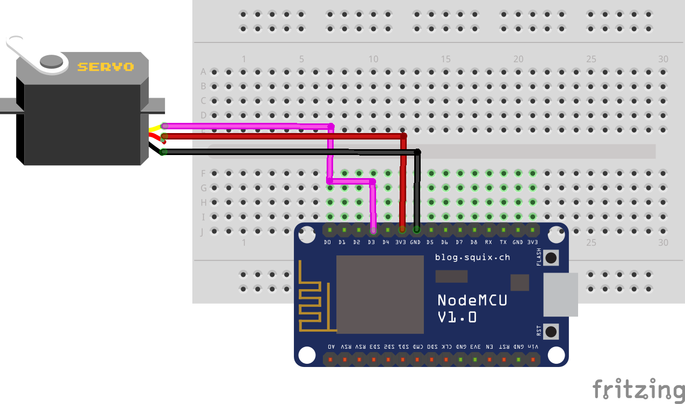

# 02-servo-telegram-bot

## Objetivo

O objetivo desse programa é demonstrar a utilização do BOT Telegram para abrir/fechar e consultar status de uma caixa utilizando um Servo motor e uma placa NodeMCU.

### Vídeo

### Circuito

### Instruções

Para abrir, fechar e verificar o status atual da caixa basta enviar os comandos `OPEN`, `CLOSE` e `STATUS` respectivamente por mensagem no chat do Telegram para o usuário Telegram BOT criado.

### Requisitos

As instruções para obter o token e as bibliotecas que são necessárias estão no [link](../README.md).
