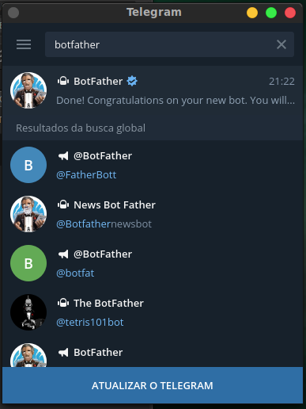
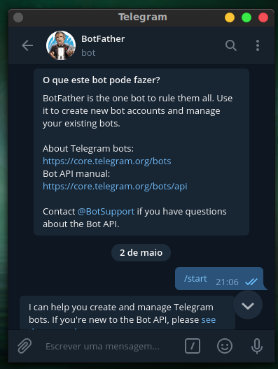
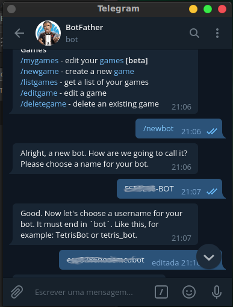
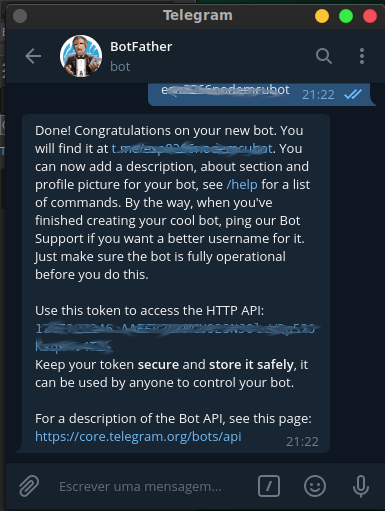
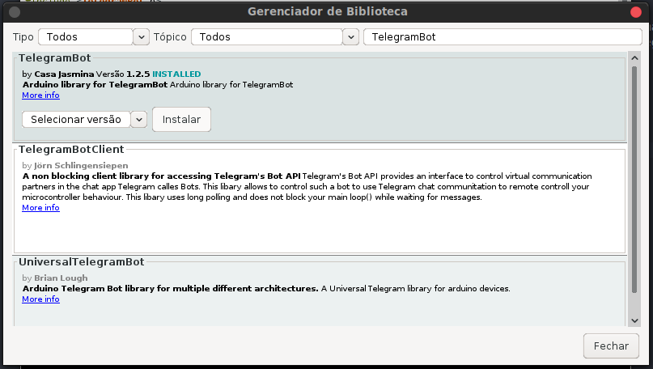

# nodemcu-telegram-bot

## Objetivo

Demonstrar a utilização da biblioteca TelegramBot com microcontroladores NodeMCU.

## Instruções

### 1° Obter Token Telegram

Para obter o token é necessário ter o programa Telegram instalado no smarphone ou no computador.

#### A) BotFather

Dentro do programa Telegram, procurar nos contatos pelo nome `BotFather`.

#### B) Iniciar BOT Telegram

Digitar dentro do chat comando `/start`

#### C) Criar BOT

Digitar comando `/newbot`, em seguida digitar o nome do BOT e o nome de um usuário bot.

#### D) Token User BOT Telegram

O token gerado é o que deve ser usado nas chamadas da biblioteca dentro do NodeMCU. Mantenha-o seguro e não perca ele.

### 2° Instalação de Bibliotecas

#### A) TelegramBot

Adicionar biblioteca `TelegramBot` by `Casa Jasmina`, nesse tutorial a versão instalada é `1.2.5`.

#### B) ArduinoJSON

A biblioteca `TelegramBot` usa uma versão antiga do `ArduinoJson` que não está disponível no gerenciador de bibliotecas, a versão `5.13.5`, você pode baixar ela no [link do desenvolvedor](https://www.ardu-badge.com/ArduinoJson/5.13.5) ou pegar ela [aqui](resources/lib/) e colocar dentro da pasta `libraries` do Arduino IDE.
